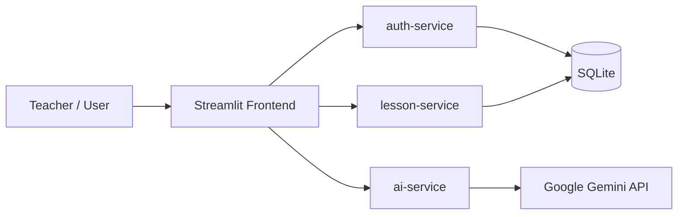

# SmartLesson AI

GitHub repository: https://github.com/OanhDiLam/Smartlesson-AI

SmartLesson AI là hệ thống hỗ trợ giáo viên soạn giáo án bằng AI theo định hướng Công văn 5512. Dự án được triển khai theo mô hình microservices tối thiểu, gồm frontend Streamlit và 3 backend service FastAPI, phù hợp để demo, báo cáo đồ án và mở rộng dần về sau.

## Tổng quan

SmartLesson AI tập trung vào 3 nhóm giá trị chính:

- Hỗ trợ giáo viên tạo giáo án nhanh hơn bằng AI
- Chuẩn hóa đầu ra giáo án và tài liệu hỗ trợ học tập
- Tạo không gian chia sẻ giáo án giữa giáo viên.

## Tính năng nổi bật

| Nhóm chức năng | Mô tả |
| --- | --- |
| Tài khoản | Đăng ký, đăng nhập, cập nhật avatar, đổi họ tên, đổi mật khẩu |
| Soạn giáo án AI | Tạo giáo án theo môn học, khối lớp, bộ sách, thời lượng, yêu cầu sư phạm |
| Tài liệu tham chiếu | Hỗ trợ file `txt`, `md`, `docx` để AI bám sát nội dung giáo viên cung cấp |
| Tài liệu hỗ trợ | Sinh câu hỏi, rubric và phiếu học tập từ giáo án đã tạo |
| Lịch sử bài dạy | Lưu và xem lại giáo án đã sinh |
| Xuất tài liệu | Xuất Word và PDF |
| Cộng đồng giáo án | Chia sẻ giáo án, tải file, like bài đăng, like bình luận, trả lời theo dạng mention |

## Kiến trúc hệ thống

Hệ thống gồm 4 thành phần:

- `frontend`
  Giao diện người dùng viết bằng Streamlit trong `app.py`
- `auth-service`
  Quản lý tài khoản người dùng, avatar và xác thực
- `lesson-service`
  Quản lý lịch sử giáo án, feed chia sẻ cộng đồng, tải file, like và bình luận
- `ai-service`
  Gọi Gemini để sinh giáo án và bộ tài liệu hỗ trợ

Thành phần dùng chung:

- `services/common/db.py`
  Kết nối SQLite và khởi tạo schema
- `services/common/security.py`
  Băm mật khẩu

## Sơ đồ kiến trúc



## Luồng hoạt động chính

1. Người dùng đăng nhập từ giao diện Streamlit.
2. Frontend gọi `auth-service` để xác thực và lấy hồ sơ người dùng.
3. Khi người dùng yêu cầu soạn giáo án, frontend gửi dữ liệu sang `ai-service`.
4. `ai-service` tạo prompt, gọi Gemini và trả nội dung giáo án về frontend.
5. Frontend gửi giáo án sang `lesson-service` để lưu lịch sử.
6. Khi chia sẻ giáo án, frontend gửi file và metadata sang `lesson-service`.
7. Các thao tác cộng đồng như like, bình luận, trả lời, tải file đều đi qua `lesson-service`.

## Công nghệ sử dụng

- Python 3.10+
- Streamlit
- FastAPI
- Uvicorn
- SQLite
- Google Generative AI SDK
- requests
- python-dotenv
- python-docx
- reportlab
- pandas
- Docker
- Docker Compose

## Cấu trúc thư mục

```text
Smartlesson-AI/
├─ app.py
├─ styles.py
├─ README.md
├─ requirements.txt
├─ Dockerfile
├─ docker-compose.yml
├─ picture/
│  └─ logo.png
├─ storage/
│  └─ smart_lesson_official_v4.db
└─ services/
   ├─ common/
   │  ├─ db.py
   │  └─ security.py
   ├─ auth_service/
   │  ├─ main.py
   │  └─ Dockerfile
   ├─ lesson_service/
   │  ├─ main.py
   │  └─ Dockerfile
   └─ ai_service/
      ├─ main.py
      └─ Dockerfile
```

## Giao diện và trải nghiệm người dùng

Frontend hiện có các khu vực chính:

- Đăng nhập và đăng ký tài khoản
- Soạn giáo án bằng AI
- Xem lịch sử giáo án
- Xuất Word/PDF
- Tạo tài liệu hỗ trợ
- Cộng đồng giáo án theo kiểu feed

Phần cộng đồng hiện hỗ trợ:

- Hiển thị avatar người đăng và người bình luận
- Feed bài chia sẻ giáo án
- Like bài đăng
- Like bình luận và trả lời
- Composer bình luận theo icon
- Trả lời theo dạng mention, ví dụ `@A nội dung trả lời`
- Tải file giáo án trực tiếp từ bài đăng
- Xóa bài đăng hoặc bình luận nếu đúng quyền

## API chính

### Auth Service

- `POST /register`
- `POST /login`
- `GET /users/{user_id}`
- `PUT /users/{user_id}/fullname`
- `PUT /users/{user_id}/password`
- `PUT /users/{user_id}/avatar`
- `GET /health`

### Lesson Service

- `POST /lessons`
- `GET /lessons/{user_id}`
- `POST /shared-lessons`
- `GET /shared-lessons`
- `DELETE /shared-lessons/{shared_lesson_id}`
- `GET /shared-lessons/{shared_lesson_id}/download`
- `POST /shared-lessons/{shared_lesson_id}/likes`
- `GET /shared-lessons/{shared_lesson_id}/comments`
- `POST /shared-lessons/{shared_lesson_id}/comments`
- `POST /shared-lessons/{shared_lesson_id}/comments/{comment_id}/likes`
- `DELETE /shared-lessons/{shared_lesson_id}/comments/{comment_id}`
- `GET /health`

### AI Service

- `POST /generate`
- `POST /generate-materials`
- `GET /health`

## Cài đặt môi trường

### Yêu cầu

- Python 3.10 trở lên
- `pip`
- Docker Desktop nếu muốn chạy bằng Docker
- Gemini API key hợp lệ

### Cài dependency

```bash
pip install -r requirements.txt
```

### Cấu hình `.env`

```env
GOOGLE_API_KEY=your_gemini_api_key
AUTH_SERVICE_URL=http://localhost:8001
LESSON_SERVICE_URL=http://localhost:8002
AI_SERVICE_URL=http://localhost:8003
SERVICE_TIMEOUT_SECONDS=30
DATABASE_PATH=storage/smart_lesson_official_v4.db
GEMINI_MODEL=models/gemini-flash-latest
```

## Chạy dự án local

Mở 4 terminal riêng:

Terminal 1:

```bash
uvicorn services.auth_service.main:app --host 0.0.0.0 --port 8001
```

Terminal 2:

```bash
uvicorn services.lesson_service.main:app --host 0.0.0.0 --port 8002
```

Terminal 3:

```bash
uvicorn services.ai_service.main:app --host 0.0.0.0 --port 8003
```

Terminal 4:

```bash
streamlit run app.py
```

Sau khi chạy:

- Frontend: `http://localhost:8501`
- Auth Service: `http://localhost:8001`
- Lesson Service: `http://localhost:8002`
- AI Service: `http://localhost:8003`

## Chạy bằng Docker Compose

```bash
docker compose up --build
```

Các service trong `docker-compose.yml`:

- `frontend`
- `auth-service`
- `lesson-service`
- `ai-service`

Frontend trong container dùng các URL nội bộ:

- `http://auth-service:8001`
- `http://lesson-service:8002`
- `http://ai-service:8003`

## Cơ sở dữ liệu

Hệ thống hiện dùng SQLite để đơn giản hóa việc triển khai và demo.

Các bảng chính:

- `users`
- `lessons`
- `shared_lessons`
- `shared_lesson_comments`
- `shared_lesson_likes`
- `shared_lesson_comment_likes`

Dữ liệu được mount qua thư mục `storage/` khi chạy Docker Compose.


## Giới hạn hiện tại

- Chưa có JWT hoặc refresh token
- Chưa có phân quyền admin đầy đủ
- Chưa có rate limiting
- Chưa có logging tập trung
- Chưa có tracing giữa các service
- Chưa có test tự động
- Chưa có API Gateway
- Chưa tách database riêng cho từng service

## Hướng phát triển

- Bổ sung tìm kiếm và lọc giáo án trong cộng đồng
- Thêm sắp xếp theo lượt thích, lượt tải hoặc thời gian đăng
- Hỗ trợ nhiều mẫu giáo án theo từng môn học
- Nâng cấp xác thực bằng JWT
- Thay SQLite bằng PostgreSQL nếu cần mở rộng
- Bổ sung kiểm thử tự động và CI/CD

## Kịch bản demo nhanh

1. Khởi động hệ thống bằng `docker compose up --build`.
2. Đăng ký tài khoản giáo viên mới và cập nhật avatar.
3. Đăng nhập vào hệ thống.
4. Tạo giáo án bằng AI.
5. Đính kèm tài liệu tham chiếu nếu cần.
6. Sinh câu hỏi, rubric và phiếu học tập.
7. Xuất Word hoặc PDF.
8. Chia sẻ giáo án lên cộng đồng.
9. Dùng tài khoản khác để like bài, bình luận, trả lời và tải giáo án.
